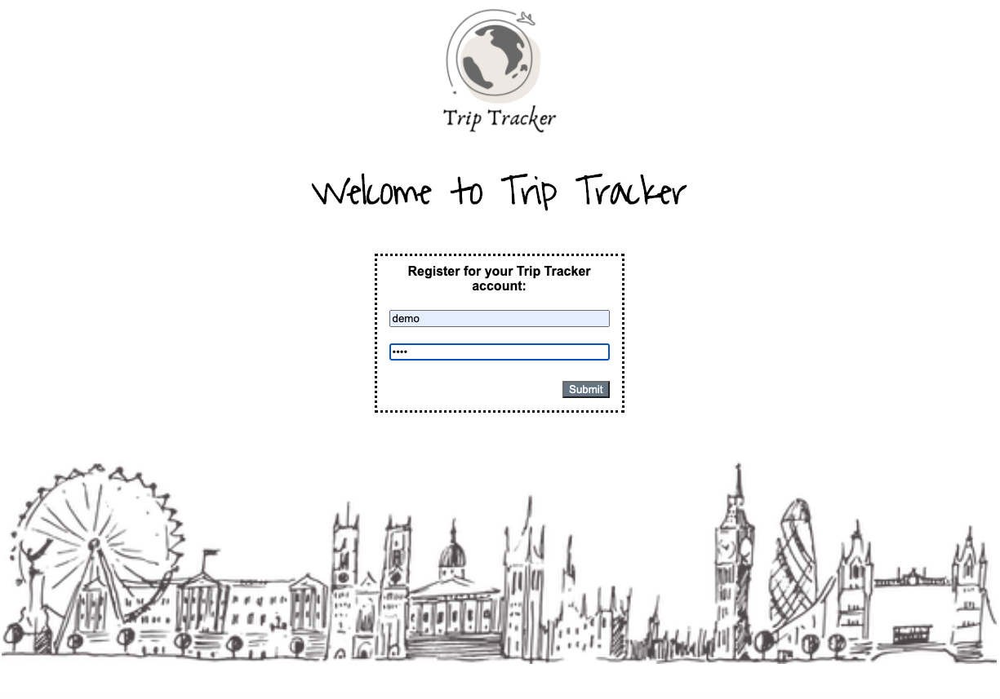
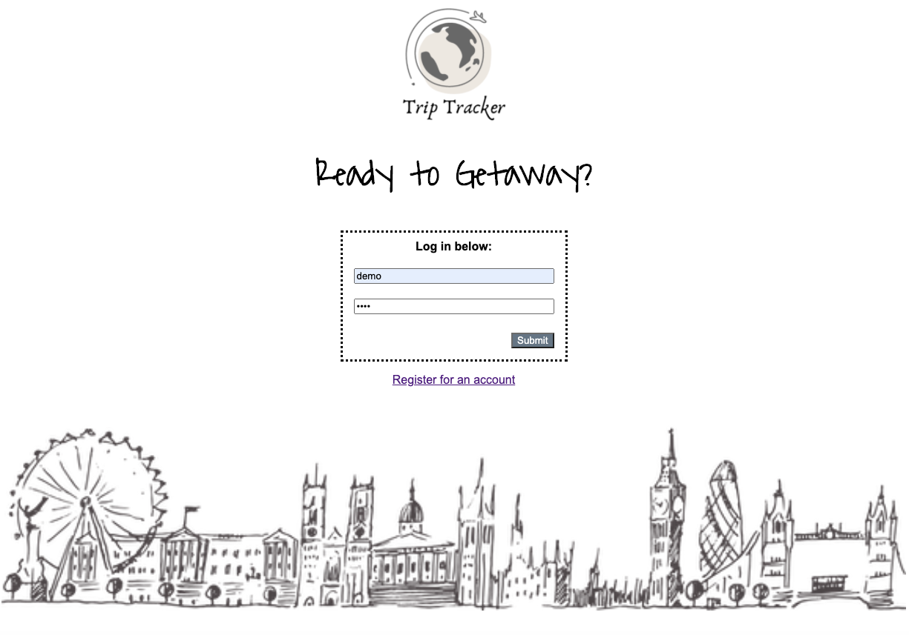
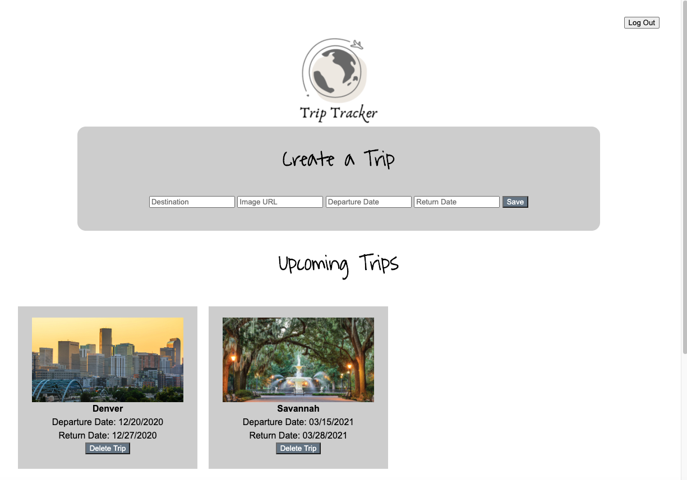
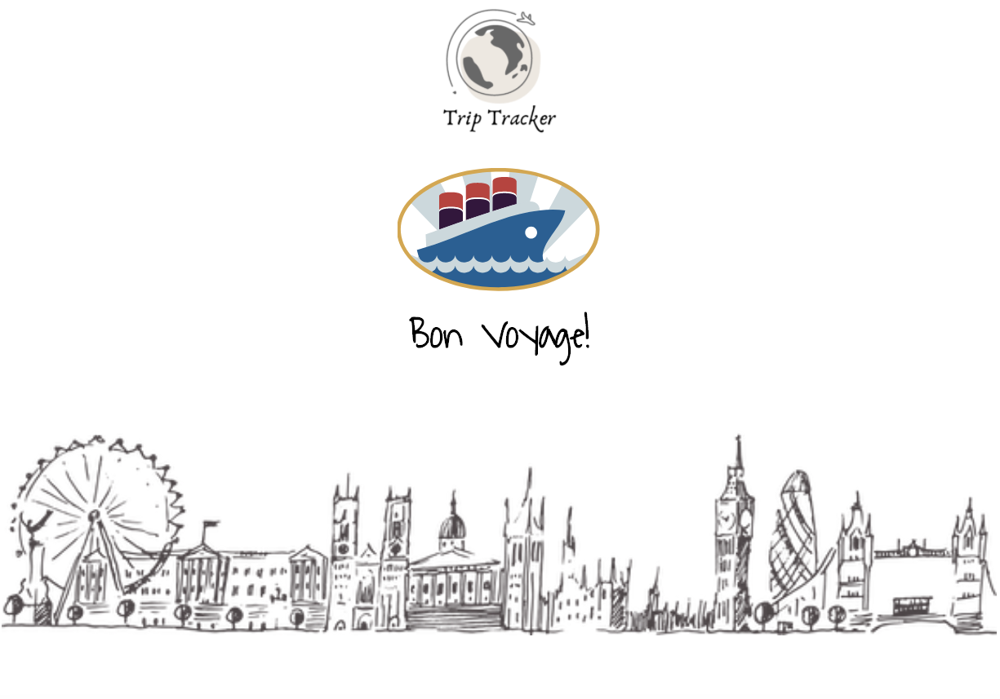
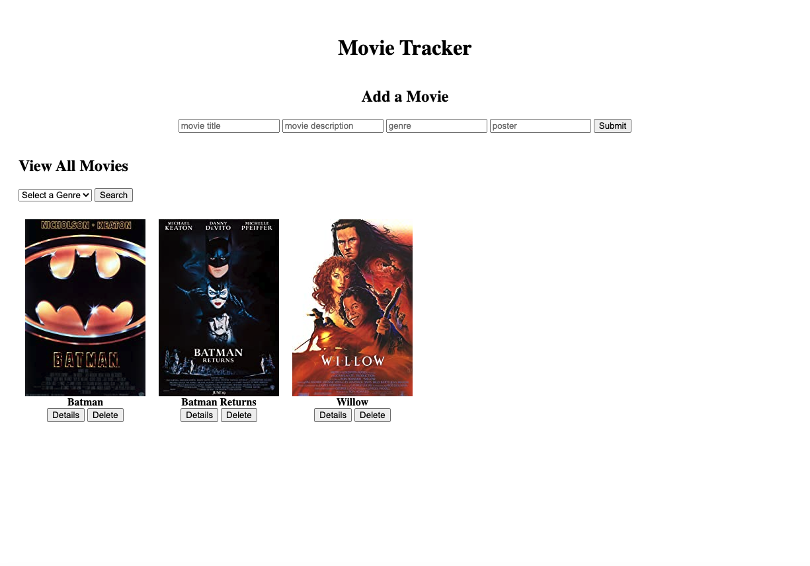
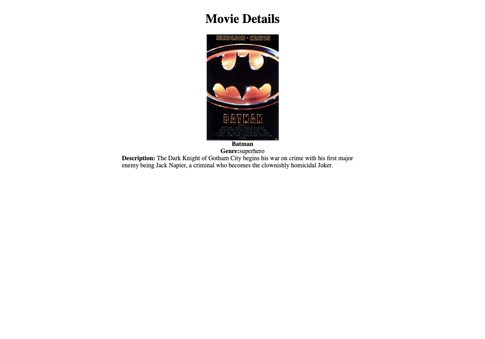
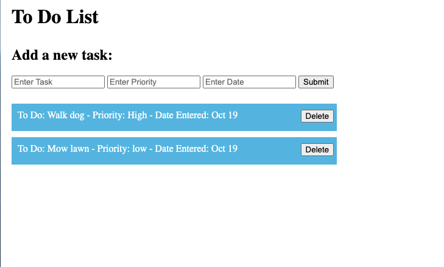

# DigitalCrafts Full-Stack Immersive: Backend 
-Coursework on backend servers. This repository contains assignments and activities from DigitalCrafts Week 7

## Summary of Work

### Trip Tracking
- Prompt: Create an app using serverside pages that allows the user to register for an account with a username and password, log in to start a sesson, input, delete and view upcoming trips, log out of their account, and save users, encrypted passwords, and trip information on a Postgres using SQL. [Visit Trip Tracking](https://github.com/kjdonoghue/DC-Backend/tree/master/trip-tracking)

Screenshots:

- Registration Page: 

-

- Log In Page: 

-

- Trips Page: 

-

- Logged Out Page: 

-

### Movie Website
- Prompt: Create an app which allows a user to add and display movies, the display should be able to sort by genre, and user should be able to select to see more deatils about the movie or delete the movie. [Visit Movie website](https://github.com/kjdonoghue/DC-Backend/tree/master/movie-website)

- Movie Listing Page: 

-

- Movie Detail Page: 

-

### To Do List
- Prompt: Create an app which allows the user to post to do list items to a web API and display the list through the user interface - [Visit To Do List](https://github.com/kjdonoghue/DC-Backend/tree/master/to-do-list)

- To Do List: 

-

### Blog Site:
- Prompt: Create a site where users can enter a blog post, post and view comments, and delete posts. Create this blog using SQL and then using Sequelize. - [Visit Blog Site](https://github.com/kjdonoghue/DC-Backend/tree/master/blog)

### Monday Activites
- Practice creating dynamic pages- [Visit Monday Activities](https://github.com/kjdonoghue/DC-Backend/tree/master/Monday-Activity)

### Tuesday Activity
- Exercises on server side pages- [Visit Tuesday Activity](https://github.com/kjdonoghue/DC-Backend/tree/master/Tuesday-Activity)

